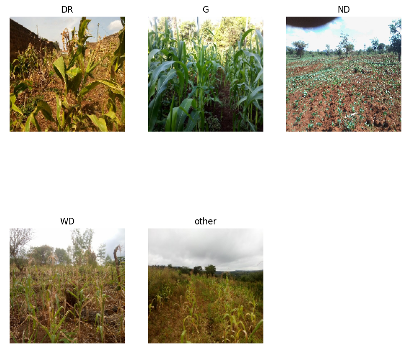

# [CGIAR Crop Damage Classification Challenge](https://zindi.africa/competitions/cgiar-crop-damage-classification-challenge)

Classify Crops as DR, WD, G, ND or other based on images

- DR: Drought affected

- WD: Weed infested

- G: Healthy

- ND: Nutrient Deficient